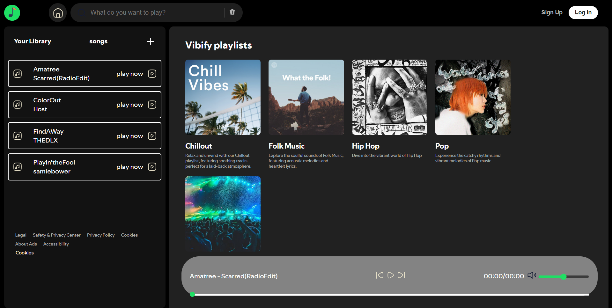

# 🎵 Vibify - Music Streaming App  

Vibify is a **Spotify-inspired music streaming application** built with **HTML, CSS, and JavaScript**.  
It allows users to play, pause, navigate between tracks, switch playlists, and enjoy a smooth, responsive music experience.  

---

## 🚀 Features  

- 🎶 Play, pause, next, and previous track controls  
- 📂 Playlist switching support  
- 🔊 Volume control and mute/unmute  
- ⏱️ Seek functionality using progress bar  
- 📱 Fully responsive design  
- 📦 Data fetched via **JSON (local file & links)**  
- ⚡ Lightweight and fast (no frameworks required)  

---

## 🛠️ Tech Stack  

- **HTML5** – Structure  
- **CSS3 (Tailwind CSS in some parts)** – Styling  
- **JavaScript (Vanilla JS)** – Functionality  
- **JSON** – Data storage for songs & playlists  

---

## 📸 Screenshots  



## 📂 Project Setup  

1. Clone the repository  
   ```bash
   git clone https://github.com/your-username/vibify.git

*Vibify is a personal project by [shivateja-droid](https://github.com/shivateja-droid). Feel free to fork, contribute, and share feedback!*
   
